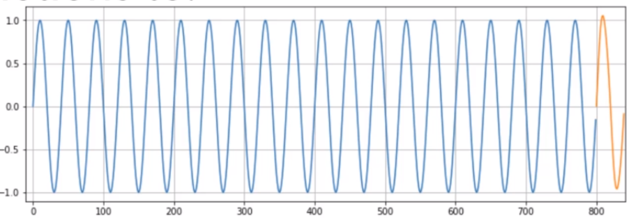

# Sine-Wave-Prediction-using-RNN (SimpleRNN and LSTM)

Recurrent Neural Network performs well in sequence datasets.

For predicting of sine wave SimpleRNN and LSTM both work nicely.

### Basic architecture of RNN

### Sine Wave Prediction

